# AWS CloudFormation Project — DIO (Fiama)


[](LICENSE)


Infraestrutura como Código (**IaC**) na AWS usando **CloudFormation**.  
Este lab cria uma **VPC pública**, um **bucket S3 privado** (com versionamento) e, opcionalmente, uma **EC2** com Apache para validação. Inclui passo a passo, parâmetros e checklist de evidências (prints).

---

## 📚 Tabela de Conteúdos
- [Objetivos](#-objetivos)
- [Arquitetura do Lab](#-arquitetura-do-lab)
- [Estrutura do repositório](#%EF%B8%8F-estrutura-do-reposit%C3%B3rio)
- [Templates](#-templates)
- [Deploy (Console AWS em PT-BR)](#-deploy-console-aws-em-pt-br)
- [Checklist de evidências (prints)](#-checklist-de-evid%C3%AAncias-prints)
- [Troubleshooting](#-troubleshooting-r%C3%A1pido)
- [Custos e limpeza](#-custos-e-limpeza)
- [Licença](#-licen%C3%A7a)


---

## 🎯 Objetivos
- Praticar IaC em ambiente real na AWS.
- Documentar o processo técnico de forma clara e reprodutível.
- Versionar e compartilhar no GitHub.

---

## 🏗️ Arquitetura do Lab
- **Stack 01 – Networking**: VPC (10.0.0.0/16), Sub-rede pública (10.0.1.0/24), Internet Gateway, Tabela de Rotas (0.0.0.0/0).
- **Stack 02 – Storage**: bucket **S3 privado**, **bloqueio de acesso público**, **criptografia AES-256** e **versionamento**.
- **Stack 03 – (Opcional) EC2 Web**: Security Group liberando **HTTP (80)** e **EC2 t3.micro** com Apache + página “Hello DIO/Fiama”.

> **Custos**: Networking ≈ 0; S3 (baixo, por uso/armazenamento); EC2 pode gerar custo fora do Free Tier — **suba, faça o print e exclua**.

---

## 🗂️ Estrutura do repositório
```
aws-cloudformation-project/
├─ README.md
├─ templates/
│  ├─ 01-networking.yaml
│  ├─ 02-storage.yaml
│  └─ 03-ec2.yaml      
└─ images/            
```

---

## 📦 Templates
- `templates/01-networking.yaml` → VPC, Sub-rede pública, IGW, Route Table, Rota e Associação.  
  **Outputs**: `VpcId`, `PublicSubnetId` (usados pela Stack 03).
- `templates/02-storage.yaml` → S3 privado com bloqueio público, criptografia, versionamento (`EnableVersioning`), e *Outputs* do bucket.
- `templates/03-ec2.yaml` *(opcional)* → Security Group (**HTTP/80**), EC2 (**t3.micro**), *User Data* instalando Apache e **Outputs** `WebUrl`/`InstancePublicIp`.

---

## 🚀 Deploy (Console AWS em PT-BR)
Região sugerida: **sa-east-1 (São Paulo)**.

### Stack 01 — Networking
1. **CloudFormation → Criar pilha → Com novos recursos (padrão)**  
2. **Carregar um arquivo de modelo** → `templates/01-networking.yaml` → **Avançar**  
3. **Nome da pilha**: `dio-networking-fiama` → parâmetros padrão → **Avançar → Avançar → Criar pilha**  
4. Validar em **VPC**: VPC, Sub-rede, Tabela de Rotas (rota `0.0.0.0/0` → IGW).

### Stack 02 — S3
1. **Criar pilha** → `templates/02-storage.yaml` → **Avançar**  
2. **Nome da pilha**: `dio-storage-fiama`  
   - **BucketName**: *único globalmente* (ex.: `aws-cloudformation-project-fiama-2025`)  
   - **EnableVersioning**: `Yes`  
3. **Avançar → Avançar → Criar pilha**  
4. Validar no **S3**: Overview do bucket, **Propriedades** (Bloqueio Público + Criptografia AES-256) e **Versionamento ativado**.

### Stack 03 — EC2
1. Pegue na Stack 01 (aba **Saídas/Outputs**): `VpcId` e `PublicSubnetId`  
2. **Criar pilha** → `templates/03-ec2.yaml` → **Avançar**  
3. **Nome**: `dio-ec2-fiama`  
   - **VpcId**: *copiar da Stack 01*  
   - **PublicSubnetId**: *copiar da Stack 01*  
   - **InstanceType**: `t3.micro`  
4. **Avançar → Avançar → Criar pilha**  
5. Ao finalizar, na aba **Saídas (Outputs)**, clique em **`WebUrl`** para abrir a página “Hello DIO/Fiama”.

### Limpeza Final
1. **Esvaziar bucket** 
2. **CloudFormation → Delete stack**.
3. Status esperado: **DELETE_COMPLETE**.

---


## 📸 Evidências (prints)

**Criação da pilha Stack 01 — Networkin**
  
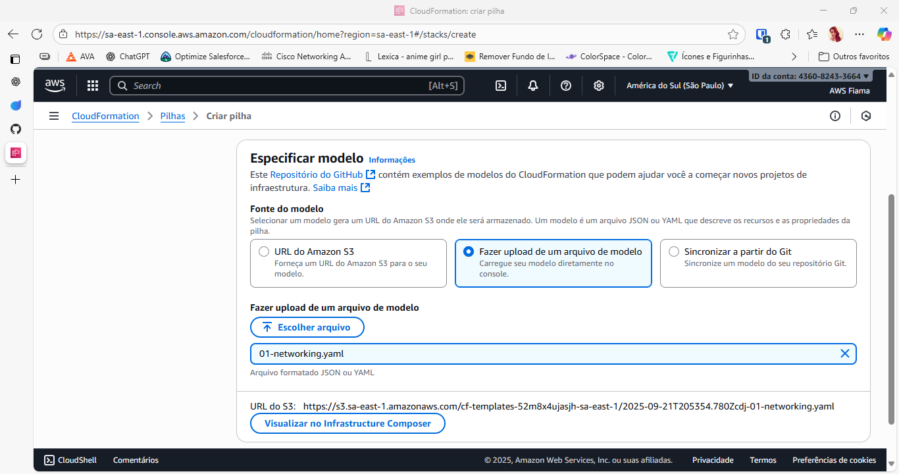


**Confirmações**
  
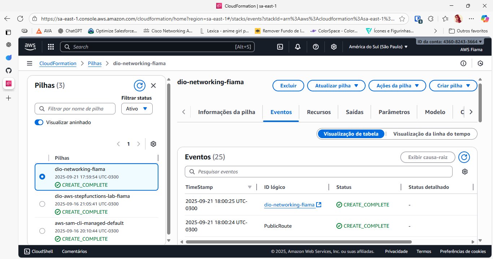
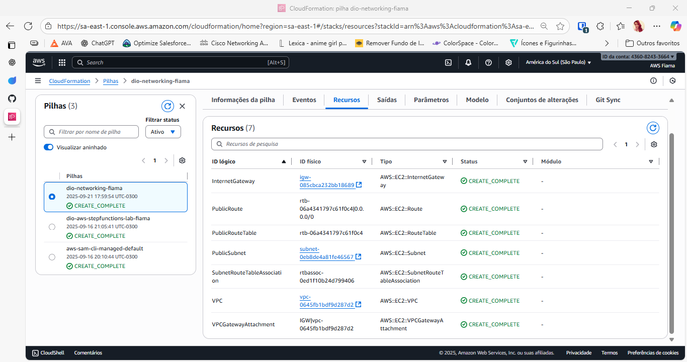
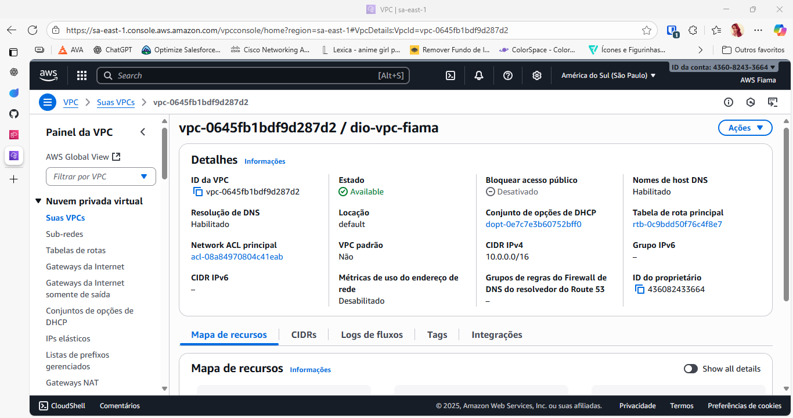

---

**Criação da pilha Stack 02 – Storage**
  
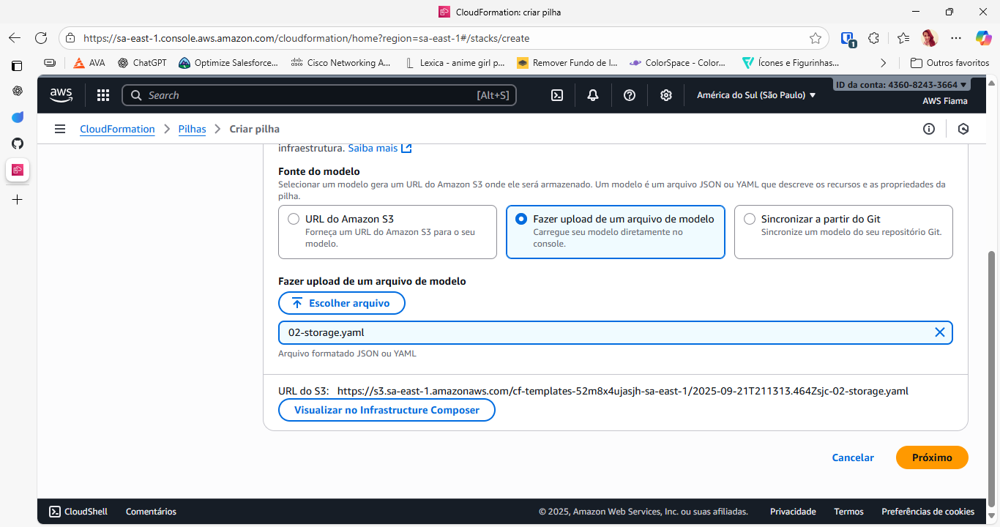


**Confirmações**
  
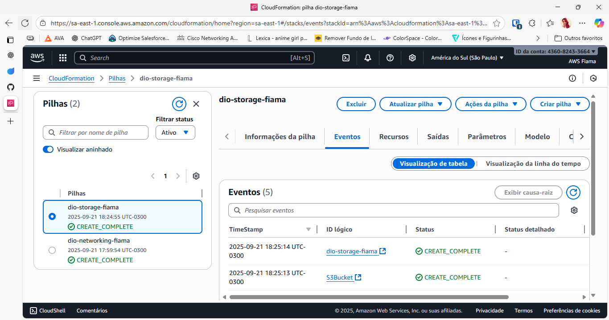
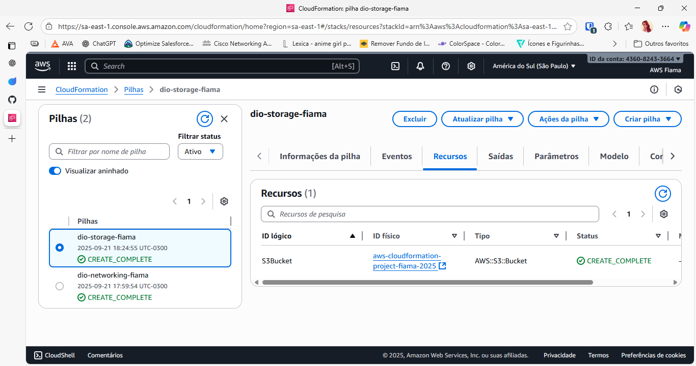

**Bucket no S3**
  
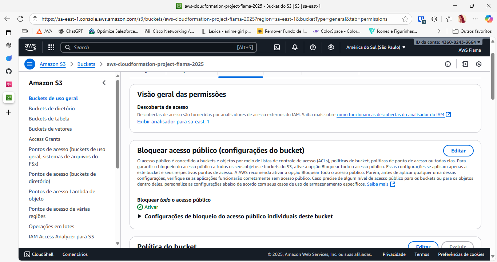
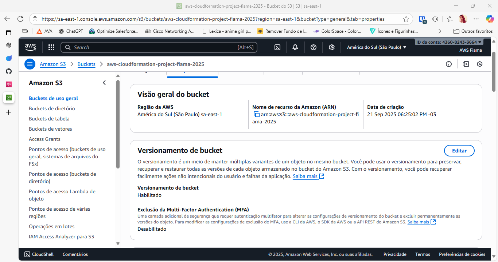

---

**Criação da pilha Stack 03 — EC2**
  
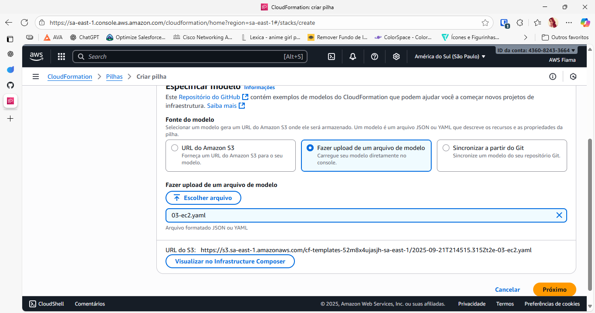
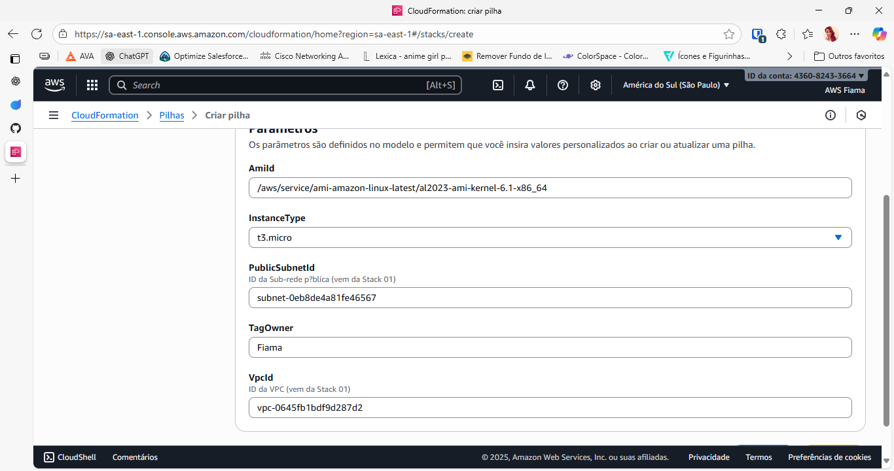

**Confirmações**
  
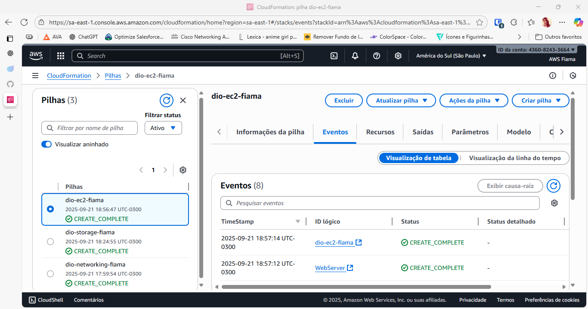
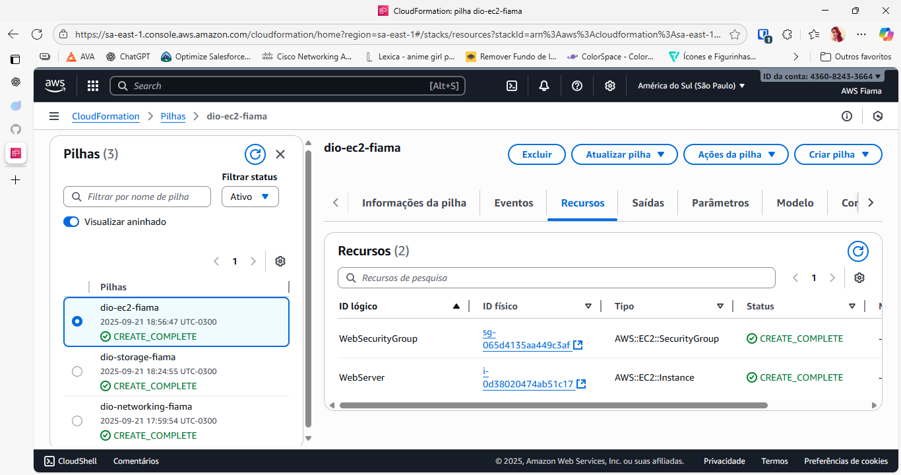
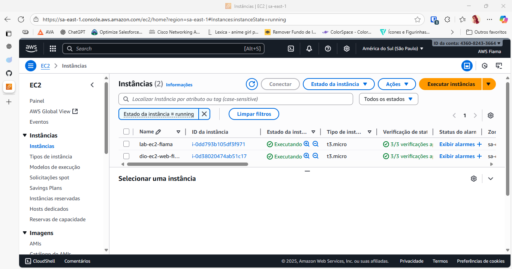
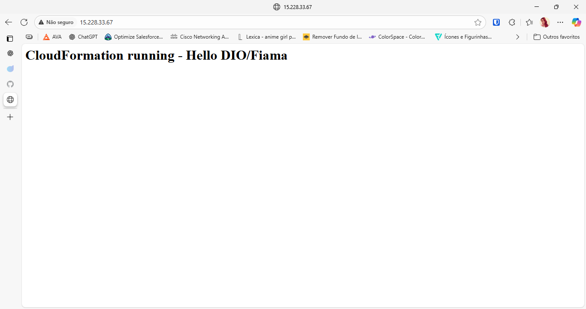

---

## 🧹 Limpeza Final

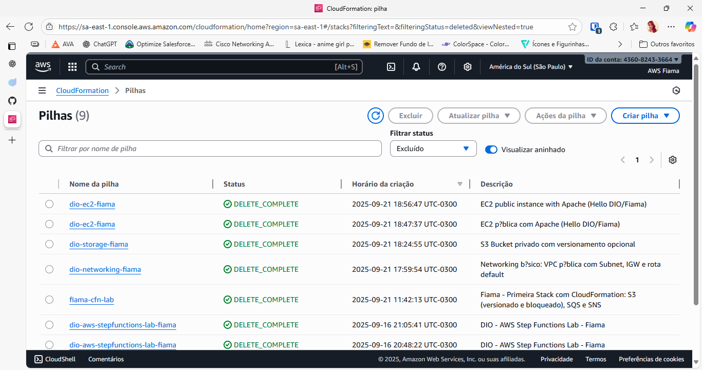

---

## 🔧 Troubleshooting rápido
- **Bucket name já existe** → troque por outro nome (único global).  
- **Falha ao apagar stack do S3** → esvazie o bucket antes de excluir.  
- **Página da EC2 não abre** → aguarde 1–2 min; confirme **SG porta 80**, Sub-rede pública, IP público e rota `0.0.0.0/0` para o IGW.  
- **Erro ASCII no Security Group** → não use acentos em `GroupDescription`.  
- **Erros YAML** → use somente espaços (sem tabs) e aspas quando houver `:` em descrições.

---

## 💰 Custos e limpeza
- Use a EC2 apenas para validar e **exclua a pilha** depois.  
- No final, exclua as pilhas na **ordem inversa**: `dio-ec2-fiama` → `dio-storage-fiama` (esvaziando o bucket antes) → `dio-networking-fiama`.

---

## ✨ Badges
- AWS CloudFormation • IaC • YAML • São Paulo (sa‑east‑1) • MIT

---

## 🧾 Licença
Este projeto é licenciado sob os termos da **MIT License**.  
Veja o arquivo [`LICENSE`](LICENSE) para mais detalhes.
